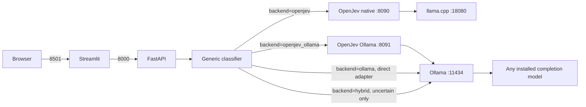

# Call Classifier — After the Ollama Change

For a deployment that downloads and exposes only native Gemma, see
[README_NATIVE_GEMMA_ONLY.md](README_NATIVE_GEMMA_ONLY.md).

This is the current installation and operating guide. The application can use either OpenJev or any locally installed Ollama model that supports text generation.

For the exact four-chunk test transcript and current measurements of all five
UI backends, see
[README_INFERENCE_BENCHMARK.md](README_INFERENCE_BENCHMARK.md). For architecture
and evidence semantics, see
[README_INFERENCE_BACKENDS.md](README_INFERENCE_BACKENDS.md).

## What changed

| Capability | Before | After |
|---|---|---|
| Inference backend | OpenJev only | OpenJev, Ollama, or native-first hybrid |
| Model selection | Fixed by OpenJev settings | Ollama models discovered dynamically |
| API request | Transcript only | Optional `backend` and `model` |
| UI | Classification form | Backend and model selectors plus form |
| Label probabilities | Available from OpenJev | Available from OpenJev; unavailable from normal Ollama structured output |
| Lightweight local startup | Required OpenJev and `llama.cpp` | Ollama-only mode can skip both |

## Runtime architecture



See [architecture.md](architecture.md) for the complete application design and [openjev-architecture.md](openjev-architecture.md) for the OpenJev internals.

## Common requirements

- Windows 10 or Windows 11
- Python 3.10 or newer; Python 3.12 is recommended
- Git
- At least one inference option:
  - OpenJev using Ollama, which is now the default;
  - the direct Python Ollama adapter; or
  - legacy OpenJev using `llama.cpp` and the configured GGUF model

## 1. Install the Python application

From the project root:

```powershell
py -3.12 -m venv venv
.\venv\Scripts\python.exe -m pip install --upgrade pip
.\venv\Scripts\python.exe -m pip install -r requirements-dev.txt
```

Verify that the same interpreter has the required packages:

```powershell
.\venv\Scripts\python.exe -c "import httpx, streamlit, fastapi; print('Python dependencies are ready')"
```

## 2. Install an inference backend

### Option A — Ollama

Install Ollama using its Windows installer, or with `winget`:

```powershell
winget install --id Ollama.Ollama --exact
```

Restart the terminal if needed. Install or create at least one text-generation model and verify it:

```powershell
$ModelName = 'your-model-name'
ollama pull $ModelName
ollama list
ollama run $ModelName "Reply with OK"
```

For an existing local model such as `gemma4:e4b`, do not pull it again. Use its exact name from `ollama list`.

The application calls Ollama at `http://localhost:11434` by default. Ollama is normally started by its desktop application. It can also be started manually:

```powershell
ollama serve
```

Only completion-capable models are shown by the application. Embedding-only models cannot perform this classification task.

### Option B — OpenJev

OpenJev remains the decision-service layer and can now use either Ollama
generation or the legacy `llama.cpp` direct engine.

Install Go and GitHub CLI if needed:

```powershell
winget install --id GoLang.Go --exact
winget install --id GitHub.cli --exact
```

Clone the validated OpenJev revision, apply both project patches, and build it:

```powershell
git clone https://github.com/axsh/openjev.git vendor/openjev
git -C vendor/openjev checkout 65ae076b501b464f0180e43f574ab451bc918e20
git -C vendor/openjev apply ..\..\patches\openjev-top-logprobs.patch
git -C vendor/openjev apply ..\..\patches\openjev-ollama-engine.patch

Push-Location vendor/openjev
& 'C:\Program Files\Git\bin\bash.exe' ./scripts/process/build.sh
Pop-Location
```

The default OpenJev path now uses Ollama and does not need the MiniCPM model or
`llama.cpp`. For the legacy direct/logprob engine, complete the additional model
runtime installation in [README_BEFORE_OLLAMA.md](README_BEFORE_OLLAMA.md#install-openjev-and-its-model-runtime).

## 3. Configure the application

The main configuration is `config/classification.yaml`. It defines:

- task prompts and labels;
- label descriptions;
- OpenJev aggregation and confidence thresholds;
- default backend and backend URLs;
- Ollama request options and timeouts.

Environment variables can override the common runtime choices:

```powershell
$env:INFERENCE_BACKEND = 'hybrid'       # or openjev, openjev_ollama, ollama
$env:OLLAMA_URL = 'http://localhost:11434'
$env:OPENJEV_URL = 'http://localhost:8090'
$env:OPENJEV_OLLAMA_SERVICE_URL = 'http://localhost:8091'
$env:OLLAMA_MODEL = 'gemma4:e4b'
$env:OPENJEV_METHOD = 'generation'
$env:OPENJEV_OLLAMA_MODEL = 'gemma4:e4b'
```

The UI and API can override the default backend per request.

## Run after the change

### Recommended — make both OpenJev engines selectable in the UI

```powershell
Set-Location 'C:\path\to\test-jev'
.\run.ps1 -OpenJevEngine both -OllamaModel gemma4:e4b
```

Then run `.\run-ui.ps1` in a second terminal. The UI offers:

- `Smart hybrid (fast)` — native OpenJev first, with the selected direct
  Ollama model used only for low-confidence or `unknown` results;
- `OpenJev native (fast)` — MiniCPM through `llama.cpp`, normally a few hundred milliseconds;
- `OpenJev native Gemma (experimental)` — Gemma 4 E4B through a separate
  `llama.cpp` and OpenJev direct/logprob service;
- `OpenJev with Ollama` — `gemma4:e4b` through OpenJev generation;
- `Ollama direct` — the categorical Python adapter.

To expose every backend, including native Gemma, use:

```powershell
.\run.ps1 -OpenJevEngine all -OllamaModel gemma4:e4b
```

The first native-Gemma run downloads the compatible official Q4_0 GGUF. The
installed Ollama Q4_K_M blob is not reusable by upstream `llama.cpp`.

Hybrid is selected by default when `run.ps1` starts both engines and no
`INFERENCE_BACKEND` override is already set. If the variable was set in the
current PowerShell session, clear it before startup:

```powershell
Remove-Item Env:INFERENCE_BACKEND -ErrorAction SilentlyContinue
.\run.ps1 -OpenJevEngine both -OllamaModel gemma4:e4b
```

### Low-latency hybrid behavior

Hybrid targets native OpenJev latency on clear calls without pretending that
Ollama itself can generate in 300 ms:

1. Native OpenJev classifies the transcript first.
2. If every task is known and has confidence at least `0.65`, that result is
   returned immediately and Ollama is not called.
3. Otherwise, the selected direct Ollama model classifies the whole transcript.

The response includes `model.routing`, and the UI states whether Ollama was
skipped or used. The threshold and unknown behavior are configurable:

```yaml
hybrid:
  fallback_confidence: 0.65
  fallback_on_unknown: true
```

A confident request should remain near the native few-hundred-millisecond path.
An uncertain request takes native latency plus Ollama latency, so 300 ms cannot
be guaranteed for every transcript on this hardware.

### Mode 1 — OpenJev using only an Ollama model

This is the requested architecture: the Python application calls OpenJev, and
OpenJev calls Ollama instead of `llama.cpp`.

Terminal 1:

```powershell
Set-Location 'C:\path\to\test-jev'
$env:INFERENCE_BACKEND = 'openjev'
.\run.ps1 -OpenJevEngine ollama -OllamaModel gemma4:e4b
```

Terminal 2:

```powershell
Set-Location 'C:\path\to\test-jev'
.\run-ui.ps1
```

To use another installed completion model, replace `gemma4:e4b` with its exact
name from `ollama list` and restart OpenJev.

### Mode 2 — Direct Ollama adapter

This is the simplest local mode and does not start OpenJev or `llama.cpp`.

Terminal 1:

```powershell
Set-Location 'C:\path\to\test-jev'
$env:INFERENCE_BACKEND = 'ollama'
.\run.ps1 -SkipOpenJev
```

Terminal 2:

```powershell
Set-Location 'C:\path\to\test-jev'
.\run-ui.ps1
```

Open <http://localhost:8501>, select `ollama`, and choose any model returned by `ollama list`, for example `gemma4:e4b`.

### Mode 3 — Legacy OpenJev with `llama.cpp`

Terminal 1:

```powershell
Set-Location 'C:\path\to\test-jev'
$env:INFERENCE_BACKEND = 'openjev'
$env:OPENJEV_METHOD = 'direct'
.\run.ps1 -OpenJevEngine llama.cpp
```

Terminal 2:

```powershell
Set-Location 'C:\path\to\test-jev'
.\run-ui.ps1
```

This starts `llama.cpp`, OpenJev, and the API and restores true constrained-token probabilities.

### Mode 4 — Run both OpenJev engines and the direct Ollama adapter

Start Ollama, then start OpenJev with that same Ollama model:

```powershell
Set-Location 'C:\path\to\test-jev'
.\run.ps1 -OpenJevEngine both -OllamaModel gemma4:e4b
```

In another terminal:

```powershell
Set-Location 'C:\path\to\test-jev'
.\run-ui.ps1
```

The UI backend selector can now compare `hybrid` (native-first with direct
Ollama fallback), `openjev` (native direct/logprob),
`openjev_ollama` (OpenJev generation through Ollama), and `ollama` (the direct
categorical adapter) without restarting any service.

## API usage

Check services and available models:

```powershell
Invoke-RestMethod http://localhost:8000/health
Invoke-RestMethod http://localhost:8000/models
Invoke-RestMethod http://localhost:8000/config
```

Use a specific Ollama model:

```powershell
$Body = @{
    transcript = "Hello, I am calling from a clinic to verify a patient's insurance eligibility."
    backend = 'ollama'
    model = 'gemma4:e4b'
} | ConvertTo-Json

Invoke-RestMethod `
    -Method Post `
    -Uri http://localhost:8000/classify `
    -ContentType 'application/json' `
    -Body $Body
```

Use OpenJev:

```powershell
$Body = @{
    transcript = "I need to book an appointment with a doctor."
    backend = 'openjev'
} | ConvertTo-Json

Invoke-RestMethod -Method Post -Uri http://localhost:8000/classify -ContentType 'application/json' -Body $Body
```

Use the low-latency hybrid route:

```powershell
$Body = @{
    transcript = "I am calling from a clinic to verify insurance eligibility."
    backend = 'hybrid'
    model = 'gemma4:e4b'
} | ConvertTo-Json

Invoke-RestMethod -Method Post -Uri http://localhost:8000/classify -ContentType 'application/json' -Body $Body
```

If `backend` is omitted, the configured default is used. If `backend` is `ollama` and `model` is omitted, the configured/default discovered model is used.

## Understanding results

OpenJev with `llama.cpp` direct mode exposes label-token probabilities. OpenJev
with Ollama generation mode instead returns normalized model-generated option
weights. Both have the same response shape and threshold handling, but only the
`llama.cpp` direct values are derived from token logprobs.

The Ollama adapter requests one valid configured label as structured JSON. Ollama's normal generation API does not provide a comparable probability distribution for this workflow, so:

- `confidence` and `probabilities` are `null`;
- long transcripts are classified by chunk;
- `vote_counts` shows how chunk results were combined;
- the result is categorical and should not be presented as calibrated confidence.

## Test and evaluate

Run the automated test suite:

```powershell
.\venv\Scripts\python.exe -m pytest -q
```

Evaluate OpenJev:

```powershell
.\venv\Scripts\python.exe scripts\evaluate.py --input samples\sample_transcripts.json --backend openjev
```

Evaluate a local Ollama model:

```powershell
.\venv\Scripts\python.exe scripts\evaluate.py --input samples\sample_transcripts.json --backend ollama --model gemma4:e4b
```

## Common problems

### `No module named 'httpx'`

The wrong Python environment launched Streamlit. Use:

```powershell
.\venv\Scripts\python.exe -m streamlit run ui.py
```

### Streamlit says the target is `.pySet-Location`

Two commands were pasted on one line. Run them separately, or use only:

```powershell
.\run-ui.ps1
```

### The UI stops immediately

Keep the PowerShell window running. Do not press `Ctrl+C`; that sends Streamlit the stop signal. If a script still exits, run `.\venv\Scripts\python.exe -m streamlit run ui.py` to expose the underlying error.

### An Ollama model is missing

Confirm `ollama list`, make sure `http://localhost:11434/api/tags` responds, and reload the UI. Embedding-only models are intentionally excluded.

### Ollama returns an invalid label

Smaller models may not reliably follow structured classification instructions. Try a stronger instruction-tuned model, shorten the transcript, or compare against the OpenJev result.
