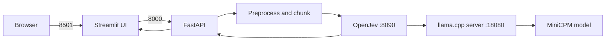

# Call Classifier — Before the Ollama Change

This document preserves the original OpenJev-only installation and run procedure. It describes the application before the Ollama adapter and runtime backend selector were added.

This is a historical baseline. For the current five-backend system, use
[README_AFTER_OLLAMA.md](README_AFTER_OLLAMA.md), and for measured long-input
behavior use [README_INFERENCE_BENCHMARK.md](README_INFERENCE_BENCHMARK.md).

## What this version did

The application classified a call transcript into three configured tasks:

- `healthcare_related`
- `caller_type`
- `intent`

The Streamlit UI called the FastAPI application, which sent every decision to OpenJev. OpenJev used a persistent `llama.cpp` server and returned probabilities for the configured labels.



## Requirements

- Windows 10 or Windows 11
- Python 3.10 or newer; Python 3.12 was the validated version
- Git and Git Bash
- Go
- GitHub CLI, used by the OpenJev setup script
- An NVIDIA GPU and a working CUDA-capable driver for the validated accelerated setup
- Sufficient disk space for the model and build artifacts

Install common command-line prerequisites with PowerShell if they are not already present:

```powershell
winget install --id Git.Git --exact
winget install --id Python.Python.3.12 --exact
winget install --id GoLang.Go --exact
winget install --id GitHub.cli --exact
```

Restart the terminal after installation, then verify:

```powershell
git --version
py -3.12 --version
go version
gh --version
```

## Install the Python application

Run these commands from the project root:

```powershell
py -3.12 -m venv venv
.\venv\Scripts\python.exe -m pip install --upgrade pip
.\venv\Scripts\python.exe -m pip install -r requirements-dev.txt
```

Using `.\venv\Scripts\python.exe` explicitly prevents packages from being installed into a different Python environment. This also avoids the earlier `ModuleNotFoundError: No module named 'httpx'` problem.

Verify the important packages:

```powershell
.\venv\Scripts\python.exe -c "import httpx, streamlit, fastapi; print(httpx.__version__, streamlit.__version__)"
```

## Install OpenJev and its model runtime

The validated OpenJev revision was:

```text
65ae076b501b464f0180e43f574ab451bc918e20
```

From the project root:

```powershell
git clone https://github.com/axsh/openjev.git vendor/openjev
git -C vendor/openjev checkout 65ae076b501b464f0180e43f574ab451bc918e20
```

Apply the project patch that raises the `llama.cpp` `top_logprobs` limit:

```powershell
git -C vendor/openjev apply ..\..\patches\openjev-top-logprobs.patch
```

Open Git Bash in the project root and run the bundled OpenJev setup scripts. The exact scripts can download/build `llama.cpp` and download the configured model:

```bash
cd /e/test-jev/vendor/openjev
./scripts/setup/install_llama_cpp.sh
./scripts/setup/download_model.sh
./scripts/process/build.sh
```

If the project is in another directory, replace `/e/test-jev` with its Git Bash path.

The original configuration expected the model and runtime values in `vendor/openjev/settings/decision-test.yaml`. Confirm its model path, worker count, and ports before starting. GPU layers and context size are supplied by the `llama.cpp` launch command.

## Run before the change

### Recommended launcher

From PowerShell in the project root:

```powershell
.\run.ps1
```

The launcher starts:

1. the `llama.cpp` model server on port `18080`;
2. OpenJev on port `8090`;
3. FastAPI on port `8000`.

In a second PowerShell terminal, start the UI:

```powershell
Set-Location 'C:\path\to\test-jev'
.\run-ui.ps1
```

Open <http://localhost:8501>.

Run `run-ui.ps1` as its own command. Do not paste it on the same line as `streamlit run ui.py`, because Streamlit can interpret the combined text as a filename such as `ui.pySet-Location`.

### Manual three-terminal startup

If the launcher is unavailable, start each layer separately.

Terminal 1 — model server, using the command and arguments defined by the OpenJev setup:

```powershell
Set-Location 'C:\path\to\test-jev\vendor\openjev'
& 'C:\Program Files\Git\bin\bash.exe' ./scripts/setup/run_llama_server.sh --parallel 1
```

Terminal 2 — OpenJev:

```powershell
Set-Location 'C:\path\to\test-jev\vendor\openjev'
.\bin\decision-test.exe
```

Terminal 3 — API:

```powershell
Set-Location 'C:\path\to\test-jev'
.\venv\Scripts\python.exe -m uvicorn app.main:app --host 0.0.0.0 --port 8000
```

Start the UI in a fourth terminal with `.\run-ui.ps1`.

## Verify the original stack

```powershell
Invoke-RestMethod http://localhost:18080/health
Invoke-RestMethod http://localhost:8090/health
Invoke-RestMethod http://localhost:8000/health
```

Classify a transcript:

```powershell
$Body = @{
    transcript = "Hello, I am calling from a clinic to verify a patient's insurance eligibility."
} | ConvertTo-Json

Invoke-RestMethod `
    -Method Post `
    -Uri http://localhost:8000/classify `
    -ContentType 'application/json' `
    -Body $Body
```

In the pre-Ollama version there was no `backend` or `model` field. OpenJev was always used.

## Configuration and testing

Classification labels, prompts, thresholds, and aggregation settings are in `config/classification.yaml`.

```powershell
.\venv\Scripts\python.exe -m pytest -q
.\venv\Scripts\python.exe scripts\evaluate.py --input samples\sample_transcripts.json
```

The OpenJev path provides label probabilities. The application aggregates those probabilities across transcript chunks and derives confidence and threshold decisions from them.

For the detailed runtime design, see [openjev-architecture.md](openjev-architecture.md).
