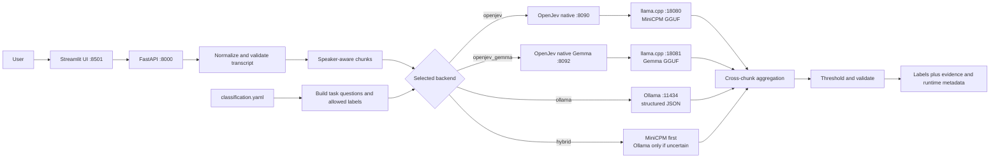

# OpenJev Call Classifier - Manager Demo Guide

This document is a presentation guide for the local call-classification proof of
concept. It explains what the system does, how questions are assigned, why its
output is more useful than ordinary free-form LLM output, how tokens are used,
why the native models use GGUF, and how to demonstrate the native MiniCPM and
Gemma paths.

> Executive summary: the project turns a transcript into controlled business
> decisions, not conversational prose. Classification tasks and allowed labels
> come from YAML. Long calls are processed without silent truncation. Native
> OpenJev asks the model for one constrained answer token per task and uses the
> model's label-token log probabilities to produce auditable evidence. All
> inference can remain on the local machine.

This is a technical POC. It is not a claim of HIPAA compliance, production
readiness, or clinically calibrated certainty.

## 1. What problem are we solving?

Given a call transcript, the application currently answers three questions:

| Task | Business question | Current outputs |
|---|---|---|
| `healthcare_related` | Is the call healthcare-related? | `yes`, `no` |
| `caller_type` | Who does the caller represent? | doctor office, hospital, clinic, pharmacy, insurer, patient/family, and other configured classes |
| `intent` | Why did the caller contact us? | appointment, eligibility, prior authorization, billing, prescription, records, and other configured intents |

The result is machine-readable JSON and a simple UI view containing the final
label, available confidence/evidence, model and backend identity, latency,
chunk count, token count reported by the backend, and confirmation that the
input was not truncated.

Example:

```text
Input:
Caller: I am calling from Dr. Patel's office to verify the patient's eligibility.

Output:
Healthcare related: Yes
Caller type: Doctor office
Intent: Eligibility check
```

## 2. Why is this better than normal LLM output?

The key advantage is control and repeatability, not a claim that the underlying
model is automatically more intelligent.

| Ordinary free-form LLM request | This classifier |
|---|---|
| May return paragraphs, explanations, or unexpected wording | Returns one label from an explicit allowed set |
| Output format can vary between calls | Response schema is stable and validated |
| May invent a new category | Out-of-vocabulary labels are rejected |
| Usually gives no comparable decision evidence | Native paths return a distribution derived from allowed label-token logits |
| Often forces an answer even when uncertain | A task threshold can convert a weak result to `unknown` |
| Long input may be silently clipped by a client or context window | Input is speaker-aware chunked; over-limit input is rejected, never silently truncated |
| Business categories are buried in prompt or source code | Tasks, label definitions, thresholds, and aggregation policies live in YAML |
| Cloud APIs can introduce data-governance and per-token billing concerns | The demonstrated models and services run locally |

The practical value is that downstream systems receive predictable fields that
can drive routing, reporting, or review queues. This is closer to a configurable
decision service than a chatbot.

Important qualification: constrained output reduces formatting failures and
category drift, but it does not guarantee that a selected label is correct.
Accuracy still requires a representative labeled evaluation set and ongoing
monitoring.

## 3. Architecture



Core responsibilities:

| Layer | Responsibility |
|---|---|
| Streamlit | Accept a transcript, select a local backend/model, and display results |
| FastAPI | Validate requests and expose `/classify`, `/health`, `/models`, and `/config` |
| Configuration | Define tasks, labels, descriptions, thresholds, chunking, and aggregation |
| Generic classifier | Run the shared preprocessing, chunking, backend, and aggregation flow |
| OpenJev adapter | Convert configured tasks into choice questions and read label distributions |
| `llama.cpp` | Keep a GGUF model loaded and perform local GPU/CPU inference |
| Evidence aggregator | Combine all chunk-level evidence into one decision per task |

## 4. How are questions assigned?

Questions are not assigned by hard-coded `if/else` rules. They are built at
runtime from [`config/classification.yaml`](config/classification.yaml).

For every enabled task, the application creates this conceptual object:

```json
{
  "caller_type": {
    "type": "choice",
    "instructions": "Determine what kind of person or organization is calling.",
    "criteria": {
      "doctor_office": "Physician, specialist, physician group or doctor's office.",
      "hospital": "Hospital, medical center or hospital department.",
      "unknown": "Not enough evidence to reliably determine caller type."
    }
  }
}
```

The real task contains all caller-type labels from the YAML file. The same
conversion happens for healthcare relevance and intent.

The runtime flow is:

1. Load all enabled tasks in YAML order.
2. Convert each task description into question instructions.
3. Convert every configured label and description into an allowed criterion.
4. Send all task questions with each transcript chunk.
5. Validate that the backend answered every task and used only allowed labels.
6. Aggregate chunk evidence using that task's configured policy.
7. Apply the task threshold. A probabilistic result below `0.60` becomes
   `unknown` while preserving the raw winning label for inspection.

Changing the taxonomy therefore usually means editing configuration rather
than changing Python or the UI. After an edit, the local development API can
reload it with:

```powershell
Invoke-RestMethod -Method Post http://127.0.0.1:8000/config/reload
```

The configuration is validated before use. OpenJev choice tasks must currently
have between 2 and 20 criteria.

## 5. How native OpenJev makes a decision

For each task, OpenJev maps the business labels to single-token letters such as
`A`, `B`, and `C`. It then:

1. builds a prompt containing the transcript chunk, question, and criteria;
2. constrains the grammar to the allowed letter tokens;
3. requests exactly one output token;
4. reads the log probability for every allowed token;
5. applies softmax across only those allowed choices;
6. maps the winning letter back to the business label.

For allowed-label log probabilities `l_i`, the displayed distribution is:

```text
p_i = exp(l_i) / sum(exp(l_j))
```

OpenJev's per-decision confidence is based on normalized entropy:

```text
confidence = 1 - H(p) / log(number_of_options)
```

This number measures how concentrated the allowed-choice distribution is. It
is useful for thresholds and comparisons within the same method, but it is not
automatically a calibrated probability that the answer is correct.

## 6. Long transcripts and aggregation

The default chunk configuration is:

```text
Maximum input:          200,000 characters
Maximum chunk:            4,000 characters
Chunk overlap:               400 characters
Preserve speaker turns:       yes
```

Whitespace and exact adjacent duplicates are normalized, but the application
does not summarize away medical terms, organization names, or the end of the
call. A single oversized speaker turn is split only when necessary. Input above
the total limit receives an error and is explicitly not truncated.

Aggregation is task-aware:

- Healthcare relevance uses `positive_evidence_max`. Strong healthcare evidence
  in any chunk can establish that the overall call is healthcare-related.
- Caller type and intent use confidence-powered probability averaging on native
  paths, reducing the influence of weak chunk decisions.
- Caller type can give the introductory chunk a small boost because callers
  commonly identify themselves at the beginning.
- A label-only backend such as direct Ollama uses categorical votes and does
  not pretend that vote shares are model probabilities.

## 7. Native MiniCPM and native Gemma

In this project, **native** means that OpenJev calls a persistent `llama.cpp`
server directly. It does not mean an unquantized base model.

| Characteristic | Native MiniCPM | Native Gemma E2B/E4B |
|---|---|---|
| API backend | `openjev` | `openjev_gemma` |
| Runtime | OpenJev + `llama.cpp` | OpenJev + `llama.cpp` |
| Model format | GGUF Q4 | GGUF Q4 |
| Decision method | One constrained token per task | One constrained token per task |
| Evidence | Allowed-label token-logprob distribution | Allowed-label token-logprob distribution |
| Primary reason to show it | Lowest predictable latency and resource use | More model capacity while retaining constrained decisions |
| Tradeoff | Smaller model can be less capable on difficult wording | Larger model uses more storage, memory, and latency |

Available native Gemma profiles:

| Profile | Artifact | Published/local documentation size | Runtime ID |
|---|---|---:|---|
| E2B | `gemma-4-E2B-it-Q4_0.gguf` | 2.84 GB decimal | `gemma4-e2b-native` |
| E4B | `gemma-4-E4B-it-Q4_0.gguf` | 4.59 GB decimal / 4.28 GiB | `gemma4-e4b-native` |

E2B and E4B use the same API backend name and ports, so only one of those two
Gemma profiles should run at a time. The recorded comparison below is for E4B;
do not present it as an E2B benchmark.

## 8. Why GGUF models?

GGUF is a practical deployment format for this local POC because it gives us:

- quantized model weights that are much smaller than full-precision weights;
- efficient local inference through `llama.cpp` on CPU and NVIDIA GPU;
- one portable model artifact with model/tokenizer metadata;
- predictable offline deployment without a cloud inference API;
- a pinned file and checksum for reproducible installation;
- direct access to token log probabilities required by OpenJev's constrained
  decision method.

Q4 quantization stores weights at roughly four-bit precision, with format-
specific overhead. It greatly reduces disk and memory requirements, making
these models practical on the validated 8 GB laptop GPU. The tradeoff is that
quantization can reduce quality compared with higher-precision weights, so each
model/quantization combination must be evaluated rather than assumed equal.

GGUF itself does not make answers more accurate. It makes the selected model
easier and cheaper to run locally, and `llama.cpp` exposes the low-level logits
needed for this architecture.

## 9. Input and output token usage

### What counts as an input token?

Input tokens include more than the visible transcript. They also include the
chat template, task instructions, and label descriptions. Token counts differ
by model tokenizer, so MiniCPM and Gemma counts should not be compared as if
one token were a universal unit.

For native OpenJev, the transcript chunk is included separately in each task
prompt. With `C` chunks and `T` enabled tasks:

```text
HTTP calls to OpenJev       = C
model-level decisions       = C x T
native output tokens        = C x T
```

The current configuration has `T = 3`. Therefore:

| Transcript | Chunks | Native decisions | Native output tokens |
|---|---:|---:|---:|
| Short call | 1 | 3 | 3 |
| Recorded long benchmark | 4 | 12 | 12 |

Although output generation is tiny, the model must still read the complete
prompt for every task. Input/prompt processing therefore dominates native
inference cost.

### Recorded token example

For the 14,704-character processed benchmark transcript with four chunks:

| Backend | Model work | Reported input tokens | Output behavior |
|---|---|---:|---|
| Native MiniCPM | 12 direct decisions | 11,796 | Exactly 12 one-token decisions |
| Native Gemma E4B | 12 direct decisions | 12,214 | Exactly 12 one-token decisions |
| Ollama direct | 4 structured generations | 5,626 | One small JSON object per chunk |
| OpenJev with Ollama | 12 generated distributions | 13,574 | About 136 numeric option values, plus JSON syntax |

The application response currently exposes
`transcript_processing.input_tokens_reported`. It sums the input count returned
by each backend call. It does **not** currently expose an
`output_tokens_reported` field:

- native direct output is known by construction: one token per task per chunk;
- OpenJev itself reports output-token usage, but the Python adapter currently
  forwards only its input-token count;
- Ollama returns an output/evaluation count, but the direct Python adapter also
  currently forwards only its prompt count.

This limitation should be stated honestly in the demo. If full production cost
telemetry is required, forwarding output-token counts is a small follow-up
instrumentation change. Local inference has no external per-token API charge;
tokens are still useful for capacity, context, and performance analysis.

## 10. Measured demonstration results

The repository's recorded test used a 14,705-character synthetic transcript,
which became four chunks after preprocessing. All successful backends returned
the expected labels: `yes / doctor_office / eligibility_check`.

| Backend | Warm application latency | Returned evidence |
|---|---:|---|
| Smart hybrid, native accepted | 1.873 s mean | MiniCPM token logprobs |
| Native MiniCPM | 1.910 s mean | Token-logprob distributions |
| Native Gemma E4B | 4.914 s mean | Token-logprob distributions |
| Ollama direct Gemma | 35.491 s mean | Categorical chunk votes |
| OpenJev with Ollama | 232.146 s, one successful run | Generated normalized weights |

Recorded native evidence for that one call:

| Model | Healthcare | Caller type | Intent |
|---|---:|---:|---:|
| MiniCPM | `yes` 99.96% | `doctor_office` 95.89% | `eligibility_check` 84.53% |
| Gemma E4B | `yes` 100.00% | `doctor_office` 99.49% | `eligibility_check` 95.57% |

Interpret these numbers carefully:

- The benchmark was run on Windows 11 with an RTX 4060 Laptop GPU and 8 GB VRAM.
- All models were resident during the comparison, using about 96% of VRAM after
  Ollama warmed up. It is not an isolated hardware benchmark.
- Three timing samples are useful for a demo comparison, not for a production
  p95/p99 service-level objective.
- Higher confidence on one call does not prove higher accuracy.
- The synthetic 20-call evaluation recorded task accuracies of 70% healthcare,
  80% caller type, and 95% intent. That dataset is a pipeline check, not a
  production-quality accuracy study.

## 11. Suggested live demo

### Option A: show only native MiniCPM

Terminal 1:

```powershell
Set-ExecutionPolicy -Scope Process Bypass
.\run-openjev-native-only.ps1
```

Terminal 2:

```powershell
.\run-ui.ps1
```

Open <http://localhost:8501>.

### Option B: show one native Gemma profile

E4B:

```powershell
.\run-gemma-only.ps1
```

Or smaller E2B:

```powershell
.\run-gemma-e2b-only.ps1
```

Start `run-ui.ps1` in a second terminal. Run only one Gemma profile at a time.

### Option C: compare all installed backends in one UI

This mode requires the configured Ollama model as well as both native GGUF
artifacts:

```powershell
Remove-Item Env:INFERENCE_BACKEND -ErrorAction SilentlyContinue
.\run.ps1 -OpenJevEngine all -OllamaModel gemma4:e4b
```

Then run `run-ui.ps1` in another terminal. For a fair native comparison, warm
each model once and explain that simultaneous model residency creates GPU
contention.

### Recommended transcript

```text
Agent: Thank you for calling. How may I help?
Caller: This is Nina from Dr. Patel's cardiology office. I am calling to check
whether the patient is currently eligible for benefits before an echocardiogram.
```

Expected result:

```text
healthcare_related = yes
caller_type        = doctor_office
intent             = eligibility_check
```

During the demo, point out:

1. The backend and model are explicit.
2. All returned values belong to the configured taxonomy.
3. Native confidence comes from constrained token logits, not from a sentence
   where the model says "I am 95% confident."
4. The result shows latency, chunks, token usage, and no truncation.
5. `Current Labels` in the UI comes from the live configuration.

## 12. API demonstration

Verify readiness:

```powershell
Invoke-RestMethod http://127.0.0.1:8000/health | ConvertTo-Json -Depth 10
Invoke-RestMethod http://127.0.0.1:8000/models | ConvertTo-Json -Depth 10
Invoke-RestMethod http://127.0.0.1:8000/config | ConvertTo-Json -Depth 10
```

Classify with native MiniCPM:

```powershell
$Body = @{
  transcript = "Caller: This is Dr. Patel's office checking patient eligibility."
  backend = 'openjev'
} | ConvertTo-Json

Invoke-RestMethod -Method Post -Uri http://127.0.0.1:8000/classify `
  -ContentType 'application/json' -Body $Body | ConvertTo-Json -Depth 10
```

For native Gemma, change the backend to `openjev_gemma`.

Interactive API documentation is available at <http://127.0.0.1:8000/docs>.

## 13. Likely manager questions

### "Is this just prompt engineering?"

No. Prompts are involved, but the solution also constrains the answer space,
validates every returned label, obtains native token-logprob evidence, handles
long transcripts, aggregates evidence across chunks, applies business
thresholds, and exposes a stable API contract.

### "Why not ask a normal LLM for JSON?"

That is supported by the direct Ollama adapter and is useful when model choice
matters. The native OpenJev path is more deterministic for classification: it
generates one constrained token, exposes comparative evidence across allowed
labels, and can abstain using thresholds. JSON generation is more verbose and
does not provide the same native label-token distribution through Ollama.

### "Why does a one-token answer still use thousands of input tokens?"

Generation length and prompt length are separate. The model must read the
transcript, instructions, and label definitions before producing the one-token
decision. Native OpenJev currently repeats the chunk once for each task.

### "Are the confidence scores true probabilities of correctness?"

No. They are derived from how concentrated the model's allowed-label token
distribution is. They are useful decision evidence but require calibration
against labeled real-world data before being interpreted as correctness odds.

### "Why not always use the largest Gemma model?"

The larger model may handle difficult language better, but it costs more
storage, VRAM, and latency. MiniCPM is the fast path; Gemma is the higher-
capacity path. The right default should be chosen from accuracy, latency, and
cost measurements on representative calls.

### "Can we add or rename an intent?"

Yes. Update the task labels and descriptions in `classification.yaml`, keep the
task within the supported 2-20 choices, reload the configuration, and rerun the
evaluation suite. No UI label code needs to change.

### "Does data leave the laptop?"

Not when every configured service URL points to localhost, as in the provided
native profiles. The POC still needs production controls such as
authentication, authorization, TLS where applicable, audit policy, restricted
logging, retention rules, and host hardening.

### "What should happen next before production?"

Use a larger representative labeled dataset; measure per-label precision,
recall, and F1; calibrate thresholds; test ambiguous and adversarial calls;
record isolated p50/p95/p99 latency and throughput; forward complete token
telemetry; and add security, monitoring, and governance controls.

## 14. One-minute presentation summary

> This project is a local, configurable transcript decision service. Instead of
> asking an LLM to write an answer, we define exact business questions and
> allowed labels in YAML. The system safely chunks a long transcript, asks every
> configured question, validates the answers, combines evidence across chunks,
> and can return unknown when evidence is weak. With native OpenJev, MiniCPM or
> Gemma produces only one constrained token per task, while we use the logits of
> all allowed labels as decision evidence. GGUF and llama.cpp let us run these
> quantized models locally with predictable artifacts and no cloud token fee.
> MiniCPM is the lowest-latency option; native Gemma provides more model capacity
> at higher compute cost. The POC demonstrates the architecture and measurable
> behavior, while production accuracy and confidence calibration still require
> representative real-world evaluation.

## 15. Detailed references

- [Project architecture](architecture.md)
- [OpenJev runtime architecture](openjev-architecture.md)
- [Native MiniCPM setup](README_NATIVE_OPENJEV_ONLY.md)
- [Native Gemma E2B setup](README_NATIVE_GEMMA_E2B_ONLY.md)
- [Native Gemma E4B setup](README_NATIVE_GEMMA_ONLY.md)
- [Inference backend comparison](README_INFERENCE_BACKENDS.md)
- [Recorded benchmark](README_INFERENCE_BENCHMARK.md)
- [Inference and operating costs](README_INFERENCE_COSTS.md)
