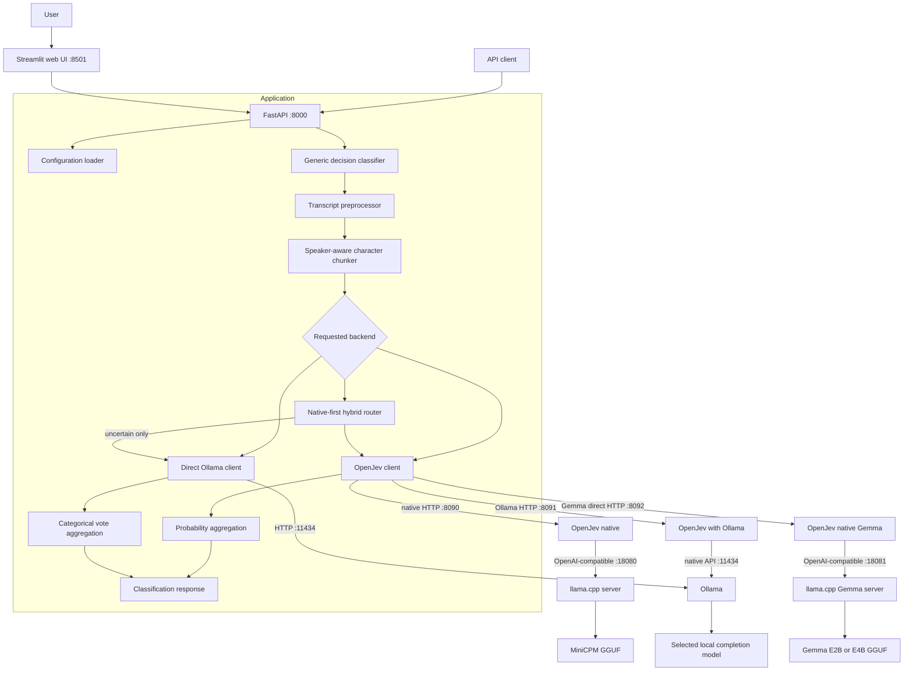
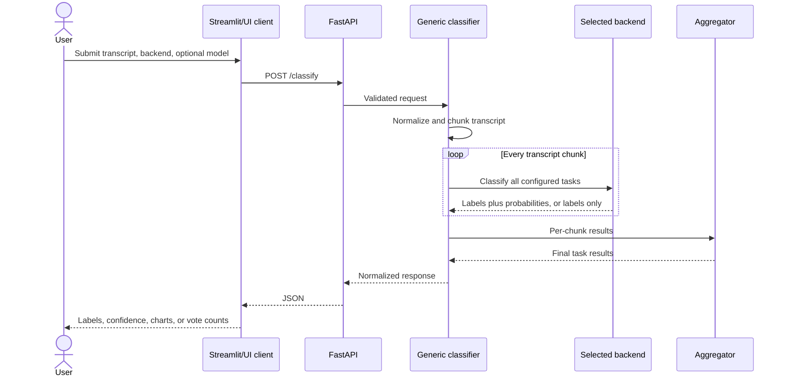
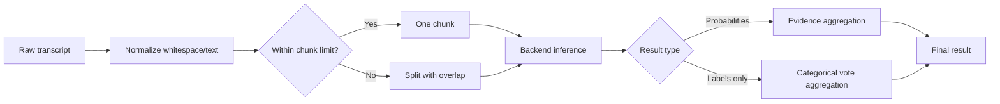

# Project Architecture

This document describes the current call-classification application and all five inference choices. OpenJev's internal implementation is covered separately in [openjev-architecture.md](openjev-architecture.md), measured four-chunk execution is documented in [README_INFERENCE_BENCHMARK.md](README_INFERENCE_BENCHMARK.md), and the presentation-oriented explanation is in [README_DEMO_GUIDE.md](README_DEMO_GUIDE.md).

## System context



All transcript inference stays on the local machine when the configured URLs point to localhost.

## Component responsibilities

| Component | Main files | Responsibility |
|---|---|---|
| Web UI | `ui.py` | Collect transcript, select backend/model, call the API, and visualize results |
| API layer | `app/main.py`, `app/api/routes.py` | Validate requests and expose health, configuration, model discovery, and classification endpoints |
| Configuration | `app/config/loader.py`, `config/classification.yaml` | Load and validate tasks, labels, thresholds, backend settings, and reloadable configuration |
| Backend router | `app/classifier/decision_client.py`, `app/classifier/generic_classifier.py` | Select a backend, perform hybrid confidence routing when requested, and normalize responses |
| OpenJev adapter | `app/classifier/openjev_client.py` | Convert configured tasks into OpenJev questions and read validated choice distributions |
| Ollama adapter | `app/classifier/ollama_client.py` | Discover completion models, request structured label JSON, and validate returned labels |
| Transcript pipeline | `app/transcript/preprocessor.py`, `app/transcript/chunker.py` | Normalize transcript text and divide long input into overlapping chunks |
| Aggregation | `app/transcript/evidence_aggregator.py` and classifier logic | Combine per-chunk probabilities or categorical votes |
| Operations | `run.ps1`, `run-ui.ps1`, `Dockerfile`, `docker-compose.yml` | Start local services and package the Python application |
| Validation tools | `tests/`, `scripts/evaluate.py`, `scripts/benchmark_requests.py`, `scripts/benchmark_all_backends.py`, `scripts/test_model.py` | Unit tests, labeled evaluation, request benchmarking, and model checks |

## Classification request flow



The three tasks are configured data, not hard-coded UI labels. A configuration reload can update task labels and descriptions without changing the frontend.

## Question construction

`GenericDecisionClassifier.build_questions()` converts every enabled task in
`config/classification.yaml` into one runtime choice question. The mapping is
deterministic:

| YAML field | Runtime question field |
|---|---|
| Classification key, such as `caller_type` | Question ID |
| Task `description` | `instructions` |
| Enabled label key | Allowed criterion name |
| Label `description` | Criterion meaning supplied to the model |
| Task `threshold` | Post-aggregation abstention threshold |

Conceptually, one generated question looks like this:

```json
{
  "caller_type": {
    "type": "choice",
    "instructions": "Determine what kind of person or organization is calling.",
    "criteria": {
      "doctor_office": "Physician, specialist, physician group or doctor's office.",
      "hospital": "Hospital, medical center or hospital department.",
      "unknown": "Not enough evidence to reliably determine caller type."
    }
  }
}
```

The actual request includes every enabled label. The same question set is sent
with each transcript chunk. OpenJev receives all questions in one HTTP request,
then schedules one model-level decision per question. The direct Ollama adapter
instead requests one structured JSON object containing all task labels for the
chunk. Both adapters validate returned labels against the configured vocabulary.

## Backend abstraction

The request selects `hybrid`, `openjev`, `openjev_gemma`, `openjev_ollama`, or `ollama`. The generic
classifier owns the shared transcript pipeline and presents a stable response
shape, while each adapter implements backend-specific inference.

At deployment time, `INFERENCE_BACKENDS` can restrict which adapter clients are
created and published by `/health` and `/models`. For example,
`INFERENCE_BACKENDS=openjev_gemma` creates only the native Gemma client. The
separate `INFERENCE_BACKEND=openjev_gemma` value makes it the request default.
`run-gemma-only.ps1` (E4B) and `run-gemma-e2b-only.ps1` (E2B) set both values
and start only ports 18081, 8092, and 8000, so the UI cannot select a backend
whose model was intentionally omitted. The profiles are alternatives and use
distinct runtime model IDs, but expose the same `openjev_gemma` API contract.

Backend and model selection follow these boundaries:

```text
Per-request backend/model override
        -> enabled client selected by FastAPI
        -> environment-selected service URL/default
        -> YAML default when no override exists
```

The request can choose only an instantiated backend. `INFERENCE_BACKENDS`
controls which clients exist; `INFERENCE_BACKEND` controls the default. Task
definitions, thresholds, chunking, and aggregation are not per-request
overrides and continue to come from the validated YAML snapshot.

### Native model deployment profiles

The two native routes have the same decision architecture but separate services
and model artifacts:

| Profile | API backend | OpenJev | `llama.cpp` | Model artifact |
|---|---|---:|---:|---|
| Native MiniCPM | `openjev` | `:8090` | `:18080` | MiniCPM5-2B Q4_K_M GGUF |
| Native Gemma E2B | `openjev_gemma` | `:8092` | `:18081` | Gemma 4 E2B Q4_0 GGUF |
| Native Gemma E4B | `openjev_gemma` | `:8092` | `:18081` | Gemma 4 E4B Q4_0 GGUF |

E2B and E4B are alternative Gemma profiles. They deliberately share ports and
the API backend name, so only one should run at a time. GGUF provides a
portable, quantized artifact for `llama.cpp`; Q4 reduces disk and memory demand,
while `llama.cpp` exposes the label-token log probabilities required by the
native direct-decision method. GGUF improves deployment efficiency, not model
accuracy by itself.

### Execution expansion by backend

Let `C` be the number of transcript chunks and `T` the number of enabled tasks.
The current configuration has `T = 3`.

| Backend | Service-level requests | Model-level decisions | Evidence returned |
|---|---:|---:|---|
| `openjev` | `C` calls to `:8090` | `C × T` direct decisions on MiniCPM `:18080` | Token-logprob distributions |
| `openjev_gemma` | `C` calls to `:8092` | `C × T` direct decisions on Gemma `:18081` | Token-logprob distributions |
| `openjev_ollama` | `C` calls to `:8091` | `C × T` Ollama generations on `:11434` | Generated normalized weights |
| `ollama` | `C` calls to Ollama | `C` structured generations containing all tasks | Categorical labels |
| `hybrid`, accepted | Same as `openjev` | Same as `openjev` | Native distributions |
| `hybrid`, fallback | Native pass plus same work as `ollama` | `C × T` native decisions plus `C` Ollama generations | Replacement categorical labels |

OpenJev receives all tasks in one HTTP request per chunk, but internally places
each task on its worker queue. Worker count controls scheduling capacity; the
underlying model runtime, GPU memory, and configured model slots determine how
much work truly executes concurrently. Increasing workers does not guarantee
lower latency on a single-GPU laptop.

### Token accounting

For both native direct routes, each model-level decision requests exactly one
answer token. The native output-token count is therefore deterministic:

```text
native output tokens = chunks (C) x enabled tasks (T)
```

With the current three tasks, a one-chunk transcript produces three direct
output tokens and a four-chunk transcript produces twelve. Input tokens are
larger because each task prompt includes the transcript chunk, instructions,
and that task's label descriptions. Counts from different model tokenizers are
not directly comparable.

`transcript_processing.input_tokens_reported` is the sum of the prompt/input
counts returned for all chunk calls. The current Python `DecisionResult` and API
response do not expose output-token counts, even though native OpenJev and
Ollama provide them at their lower-level interfaces. Direct native output can
still be calculated from `C x T`; complete output-token telemetry requires the
adapters and response contract to forward those fields.

### Hybrid path

1. Classify the complete transcript with native OpenJev.
2. Inspect every configured task after chunk aggregation and thresholding.
3. Return immediately when every label is known and confidence meets the
   configured hybrid fallback threshold.
4. Otherwise classify the complete transcript with the selected direct Ollama
   model and return that categorical result.
5. Record the chosen path, reason, and per-backend timing in `model.routing`.

This is latency routing, not faster Ollama inference. Confident calls incur only
the native path; uncertain calls incur native plus Ollama latency. Routing the
whole transcript avoids mixing probabilistic native evidence with categorical
Ollama evidence inside one aggregation pass.

### OpenJev path

1. Build one OpenJev `choice` question per configured task.
2. Submit all questions for a chunk in one `/v1/systemone` request.
3. OpenJev routes each question to its configured `ollama` or `llama.cpp` engine.
4. Read the selected label and normalized probability vector.
5. Aggregate probability evidence over chunks and apply thresholds.

For `openjev_ollama`, option weights are generated by the model, normalized by
the adapter, and strictly validated by OpenJev. For the native `openjev` and
`openjev_gemma` routes, the distribution comes from constrained label-token
log probabilities exposed by `llama.cpp`. Both methods return numeric
confidence, but their probability sources are not equivalent.

### Ollama path

1. Discover locally installed models from Ollama.
2. Exclude models that cannot generate text.
3. Build a task prompt containing only the labels and their descriptions.
4. Request structured JSON constrained to a configured label.
5. Validate the returned label exactly.
6. Aggregate chunk labels using task-aware categorical voting.

This path does not invent probability values. Confidence and probabilities remain `null`, while `vote_counts` preserves aggregation evidence.

## Long-transcript processing



Chunk size and overlap are configured in `config/classification.yaml`. Overlap reduces the risk of losing context at a boundary but can repeat evidence, so aggregation must be consistent across all chunks.

### Probability aggregation

The OpenJev path supports the configured aggregation policies:

- healthcare detection favors the strongest positive evidence across chunks;
- multiclass caller type and intent combine chunk distributions using
  confidence-powered averaging;
- the winning aggregate probability is compared with the task threshold; a
  result below threshold is returned as `unknown` while its `raw_label` remains
  available for inspection.

### Categorical aggregation

The Ollama path has no distribution to average:

- healthcare uses positive-evidence behavior so a relevant chunk can make the whole call healthcare-related;
- non-`unknown` votes take precedence when substantive evidence exists;
- caller introductions can help break caller-type ties;
- `vote_counts` is returned for transparency.

## HTTP interface

| Method and path | Purpose |
|---|---|
| `POST /classify` | Classify a transcript with an optional backend and model override |
| `GET /health` | Report API/backend availability |
| `GET /models` | List supported backends, hybrid fallback choices, and dynamically discovered Ollama models |
| `GET /config` | Return the active public classification configuration |
| `POST /config/reload` | Reload configuration from disk |

Representative request:

```json
{
  "transcript": "I am calling from a clinic to verify insurance eligibility.",
  "backend": "ollama",
  "model": "gemma4:e4b"
}
```

The response identifies the backend and model and returns one result for every configured task.

### Response contract

Each task result uses one of two evidence shapes:

| Backend evidence | Fields |
|---|---|
| Probability distribution | `raw_label`, `label`, `confidence`, `threshold`, `threshold_applied`, `probabilities` |
| Categorical labels only | `raw_label`, `label`, `confidence: null`, `threshold_applied: false`, `probabilities: null`, `vote_counts` |

Every successful response also contains:

- `transcript_processing`: original and processed character counts, chunk count,
  `truncated: false`, and reported input tokens;
- `model`: model name, backend, method, end-to-end latency, backend elapsed time,
  average chunk time, and the probability source;
- `model.routing` for hybrid calls, including whether fallback was used and why;
- optional per-chunk evidence under `debug` when
  `RETURN_CHUNK_DETAILS=true`.

The `probability_source` field distinguishes native token log probabilities,
model-generated distributions, mixed evidence, and unavailable probabilities.

## Processes and ports

| Process | Default port | Used by |
|---|---:|---|
| Streamlit | 8501 | Optional browser UI |
| FastAPI/Uvicorn | 8000 | All application modes |
| Ollama | 11434 | Direct Ollama, OpenJev-with-Ollama, and hybrid fallback |
| OpenJev native | 8090 | Native MiniCPM and the first stage of hybrid |
| OpenJev with Ollama | 8091 | OpenJev generation-mode adapter testing |
| OpenJev native Gemma | 8092 | Native Gemma E2B or E4B |
| MiniCPM `llama.cpp` server | 18080 | Native MiniCPM token-logprob decisions |
| Gemma `llama.cpp` server | 18081 | Native Gemma token-logprob decisions |

The API can be used without Streamlit. The backend model processes remain persistent so model weights are not reloaded for every classification.

## Configuration boundaries

`config/classification.yaml` is the main policy boundary. It contains task definitions, label vocabulary, prompt guidance, transcript chunking, backend endpoints, thresholds, and inference options.

Environment variables are best suited to deployment-specific values such as backend selection or service URLs. Per-request fields are best suited to interactive backend/model selection.

`INFERENCE_BACKEND` chooses the default route; `INFERENCE_BACKENDS` is a
comma-separated allow-list of instantiated routes. Keeping those two values
consistent prevents a default from pointing to a disabled client. The native
Gemma-only profile and full installation procedure are documented in
[README_NATIVE_GEMMA_ONLY.md](README_NATIVE_GEMMA_ONLY.md).

Backend/model selection precedence is conceptually:

```text
request override → environment/runtime override → classification.yaml default
```

## Failure behavior

- Invalid input is rejected at the API boundary.
- An unknown backend or Ollama model produces a clear client error.
- Backend connection or timeout failures are translated to API errors rather than fabricated classifications.
- A backend label outside the configured vocabulary is rejected.
- Ollama probability fields remain `null` instead of presenting generated numbers as measured confidence.
- OpenJev health depends on both its decision service and the underlying model server being ready.

## Source layout

```text
app/
  api/                 HTTP routes and schemas
  classifier/          backend abstraction and adapters
  config/              configuration loading and validation
  transcript/          preprocessing, chunking, aggregation
config/
  classification.yaml  classification policy and backend settings
vendor/openjev/         pinned OpenJev source checkout
patches/                local OpenJev compatibility patch
samples/                sample/evaluation transcripts
scripts/                setup, evaluation, benchmark utilities
tests/                  automated tests
ui.py                   Streamlit application
run.ps1                 backend and API launcher
run-ui.ps1              UI launcher
```

## Adding another backend

A new backend should implement the same conceptual operations as the existing adapters:

1. availability/health checking;
2. optional model discovery;
3. classification of every configured task for one transcript chunk;
4. strict validation against configured labels;
5. an explicit declaration of whether real probability distributions are available.

Register it in the backend router and `/models` response, then choose probability or categorical aggregation based on its actual output. Do not synthesize confidence merely to match the OpenJev shape.

## Privacy and deployment notes

Local URLs keep inference on the laptop, but transcripts still appear in
application memory and cross boundaries between local processes. Debug logging
at any layer must be reviewed to prevent accidental content capture. Healthcare
or other sensitive data should use restricted host binding, access controls,
encrypted storage where applicable, minimal logging, and an organizational
retention policy before production use.

The Python API logs transcript length and result metadata, not the raw transcript.
`LOG_TRANSCRIPTS` is false by default and is reserved for an explicit diagnostic
implementation. Operators must still audit logs across FastAPI, OpenJev,
`llama.cpp`, Ollama, the terminal, and any surrounding infrastructure before
handling sensitive data.

The current application is a local proof of concept. Authentication, authorization, TLS termination, audit logging, rate limiting, and production observability are deployment responsibilities rather than properties of the local launcher.
