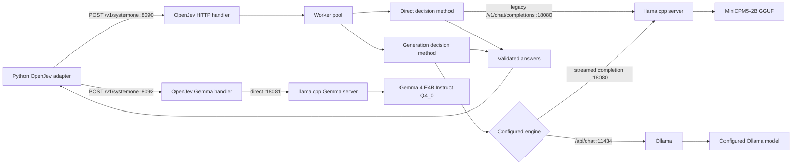
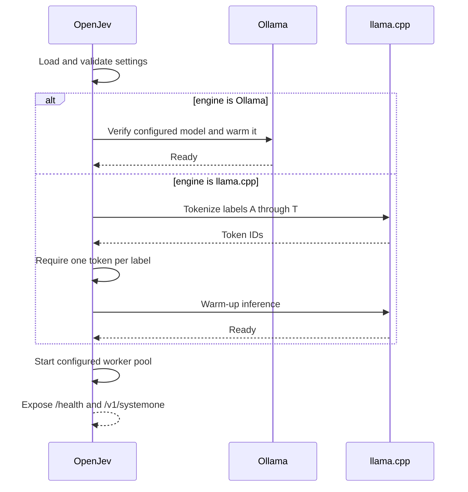
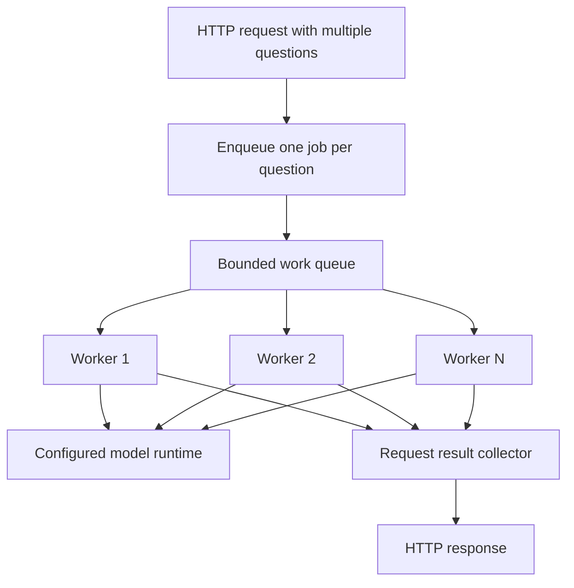
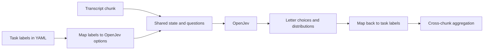

# OpenJev Architecture

This document describes the OpenJev inference path used by this project. It is intentionally separate from [architecture.md](architecture.md), which covers the full Python application and the Ollama adapter.

The exact long-transcript benchmark and observed execution cost of each path
are in [README_INFERENCE_BENCHMARK.md](README_INFERENCE_BENCHMARK.md).

## Role in this project

OpenJev is a local decision service between the Python classifier and a model
runtime. This project supports the Ollama generation engine plus two
`llama.cpp` direct/logprob services: fast MiniCPM and experimental Gemma 4 E4B.



The project pins OpenJev revision:

```text
65ae076b501b464f0180e43f574ab451bc918e20
```

## Runtime processes

| Layer | Default port | Function |
|---|---:|---|
| Python API | 8000 | Converts classification tasks to OpenJev choice questions and aggregates chunk results |
| OpenJev native | 8090 | Uses `llama.cpp` direct decisions for the fast UI choice |
| OpenJev with Ollama | 8091 | Uses Ollama generation for the higher-latency UI choice |
| OpenJev native Gemma | 8092 | Uses Gemma 4 E4B by default, or the E2B-only profile, through `llama.cpp` direct decisions |
| Ollama | 11434 | Default engine; keeps the configured Ollama model loaded and produces structured option weights |
| `llama.cpp` server | 18080 | Optional legacy engine for direct token-logprob decisions |
| Gemma `llama.cpp` server | 18081 | Experimental Gemma direct token-logprob engine |
| Model | none | Produces constrained token logits or generated probability JSON |

OpenJev does not load model weights itself. Its startup warms and verifies the configured Ollama or `llama.cpp` model runtime.

## Ollama engine

The project patch `patches/openjev-ollama-engine.patch` adds a native Ollama
engine. It sends each OpenJev generation question to `/api/chat` with:

- the configured model name;
- temperature `0` and thinking disabled;
- a JSON Schema requiring every OpenJev option key;
- numeric values constrained between `0` and `1`;
- the configured context and keep-alive values.

Models sometimes return valid non-negative weights that do not sum to exactly
one. The engine normalizes a complete valid key set, then passes the result to
OpenJev's existing strict generation validator. Consequently these values are
model-generated relative weights—not observed token probabilities and not
calibrated confidence.

The Ollama engine intentionally rejects `direct` decisions because Ollama does
not expose the token IDs and complete option logprobs required by that method.
Requests must use `options.method: generation`; the Python configuration and
launcher set this automatically.

## Startup lifecycle



The label-token lookup is performed only for the `llama.cpp` engine. Ollama
generation still uses labels `A` through `T` in its structured keys but does
not require their tokenizer IDs. Both engines support at most 20 choice options.

## Request model

The `/v1/systemone` endpoint accepts shared state and a list of questions. A simplified request is:

```json
{
  "state": "Transcript text shared by all questions",
  "questions": {
    "intent": {
      "type": "choice",
      "instructions": "What is the caller's primary intent?",
      "criteria": {
        "appointment": "Schedule or change an appointment",
        "billing": "Ask about charges or payment",
        "unknown": "No supported intent is clear"
      }
    }
  },
  "options": {
    "method": "generation"
  }
}
```

Question constraints include:

- `choice`: 2 to 20 options;
- `score`: a bounded integer scale, with the supported configured range constrained by OpenJev;
- `noul`: a true/false decision;
- `method`: `direct`, `generation`, or `both` where supported.

The Python adapter uses `choice` questions with `generation` for the default
Ollama engine. It can use `direct` when OpenJev is started with the legacy
`llama.cpp` engine. One request classifies healthcare relevance, caller type,
and intent against the same transcript chunk.

## Direct decision method

The direct path is retained for the legacy `llama.cpp` engine because it exposes
a distribution over the allowed answer-label token logits. Ollama-backed
OpenJev does not use this path.

### Prompt and constraints

For each question, OpenJev:

1. maps options to letter labels such as `A`, `B`, and `C`;
2. constructs a prompt that asks for exactly one allowed label;
3. builds a grammar that permits only those labels;
4. applies a positive logit bias to the allowed label token IDs;
5. requests one output token with log-probability information.

Conceptually, the model request uses settings equivalent to:

```text
max_tokens = 1
temperature = 1
top_k = 0
top_p = 1
logprobs = true
top_logprobs = at least 1024 in this project's compatibility patch
cache_prompt = false
enable_thinking = false
```

### Probability calculation

Let `l_i` be the returned log-probability for allowed option token `i`. OpenJev normalizes the allowed choices with softmax:

```text
p_i = exp(l_i) / Σ_j exp(l_j)
```

The selected option is the maximum-probability label:

```text
choice = argmax_i p_i
```

For score and boolean questions, the same normalized option distribution is mapped to the corresponding output value.

### Confidence calculation

The local OpenJev implementation derives confidence from normalized entropy:

```text
H(p) = -Σ_i p_i log(p_i)
confidence = 1 - H(p) / log(n)
```

where `n` is the number of options. Confidence approaches `1` when probability mass is concentrated on one option and approaches `0` for a uniform distribution.

This is an uncertainty measure derived from the model's constrained token logits. It is useful for relative thresholding but is not automatically a calibrated real-world probability of correctness.

## Generation decision method

The generation path asks the model to produce a JSON mapping from all option names to numeric probabilities. A grammar constrains the structure, and OpenJev validates that:

- every expected key is present;
- no unexpected key is present;
- values are within the allowed range;
- probabilities form a valid distribution within tolerance;
- key order and format meet the parser's requirements.

The response is streamed from `llama.cpp` or returned as structured JSON by
Ollama. Once validated, OpenJev derives the selected answer and entropy-based
confidence from the returned distribution.

Generation is more verbose and relies on the model following a probability-reporting task. The direct path instead derives its distribution from constrained token logits and is the default relevant to this classifier.

With `method: both`, OpenJev can run both approaches for comparison where the endpoint and settings support it.

## Concurrency model



OpenJev uses a configured worker pool rather than starting a new process for every question. The inspected revision has a bounded queue and a stall timeout. Questions that complete are collected by ID; if the service reaches its stall deadline, the handler can return completed answers while missing work is omitted.

The Python adapter must therefore validate that every requested task has an answer rather than assuming presence.

## Health and failure boundaries

OpenJev exposes:

- `GET /health` for readiness;
- `POST /v1/systemone` for decisions.

Common failure causes are:

- Ollama is unavailable or the configured Ollama model is not installed;
- for the legacy engine, `llama.cpp` is unavailable or its model path is wrong;
- for the legacy engine, CUDA or GPU layer configuration is incompatible;
- an allowed answer label is absent from returned top log-probabilities;
- a request exceeds a timeout or the worker queue stalls;
- the model emits invalid generated JSON in generation mode.

The startup warm-up and label tokenization checks detect several configuration problems before the API is treated as ready.

## Project-specific patch

The project applies:

```text
patches/openjev-top-logprobs.patch
```

The patch increases the requested `top_logprobs` floor from 64 to 1,024. This
is necessary because a constrained answer token may still be absent from a
small top-N result. In the 14,704-character Gemma test, valid option `G` for
caller type ranked below the first 512 returned tokens in three chunks. OpenJev
does not replace the missing value with an invented floor: it requests a wide
enough result and still fails explicitly if any required token is absent.
OpenJev's direct calculation requires a log-probability for every allowed label
before it can normalize the full choice distribution.

Apply it to the pinned source checkout with:

```powershell
git -C openjev apply ..\patches\openjev-top-logprobs.patch
```

Do not assume the patch applies cleanly to arbitrary future OpenJev revisions; inspect upstream changes before upgrading.

## Python integration

For each transcript chunk, `app/classifier/openjev_client.py` sends the same chunk as shared state and builds a question from each task in `config/classification.yaml`. It maps OpenJev's option result back to the original configured label, preserves the distribution, and passes it to the shared aggregation layer.



Label order must remain stable through this round trip. A probability at index `i` belongs to the configured label that was mapped to option letter `i`.

## Model substitution boundaries

The `llama.cpp` model behind OpenJev can be replaced only if the replacement is compatible with the server, chat template, tokenization assumptions, constrained grammar, and available hardware. The configured model must also produce all answer letters as valid single tokens for direct mode.

An installed completion-capable Ollama model can now be selected for OpenJev at
startup with `-OllamaModel` or `OPENJEV_OLLAMA_MODEL`. The service is restarted
when changing that model. Output semantics depend on the engine:

- `llama.cpp` with `direct` returns a constrained-token distribution;
- Ollama with `generation` returns normalized, validated model-generated weights;
- the separate direct Python Ollama backend returns only a categorical label.

## Operational guidance

- Keep Ollama running and use `keep_alive` so the selected model remains loaded.
- For the legacy engine, keep `llama.cpp` alive and match its URL and port.
- Tune GPU layers and context size for the laptop rather than copying settings blindly.
- Treat worker count as a throughput setting; excessive concurrency can increase latency or exhaust GPU memory.
- Re-run evaluation after changing the model, prompt, grammar, quantization, or OpenJev revision.
- Do not interpret entropy confidence as clinical certainty or deploy it as a medical decision without task-specific calibration and governance.
